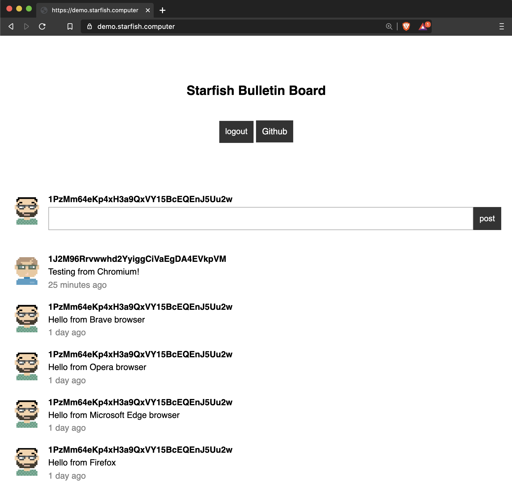

# starfish-forum

A minimalist forum app powered by Starfish authentication.

# Try

You can try the demo at https://demo.starfish.computer/



Also watch the video tutorial for this app here: https://youtu.be/teip7xN0Bo0?t=85

# How to run

```
git clone https://github.com/sobachef/starfish-forum.git
npm install
npm start
```

and then open http://localhost:3028

# App Structure

There are only two files:

1. `index.js`: The server side code
2. `indes.ejs`: The frontend template (ejs template)

The server side code `index.js` is an express app that uses cookies to log in users. In a typical express.js app, you would have to maintain a separate user authentication database where you keep a email/hashed password or username/hashed password pairs. But in this app, there is no password or user token database because all authentication happens on the client side through the Starfish Bitcoin wallet, and the only thing needed on the server side is to verify the authenticity of the signature.

Also, the posts are persisted using nedb.

# How the authentication works

There are 3 phases:

1. At Login
2. After Login
3. At Logout

## 1. At Login

When a user wants to log in, the user clicks the "connect" button. Here's what happens when the connect button is clicked:

1. The frontend code asks Starfish to sign a unique CSRF token.
2. It sends backe the response which includes the original CSRF token, the signature, and the address.
3. The server can use those three values to verify the authenticity. Because the CSRF is assumed to be unique, we just need to check that the signature is correct.
4. When the server verifies the signature, it sets the cookie with the Bitcoin address as the user's identity.

## 2. After Login

From this point on, it's business as usual. The server can use the cookies to determine the user and update its state. (There are other, even more secure ways to do this, but that's for another day).

## 3. At Logout

Logging out is the same as any other authenticated web app implementatioin, you just clear the cookie from the server.
